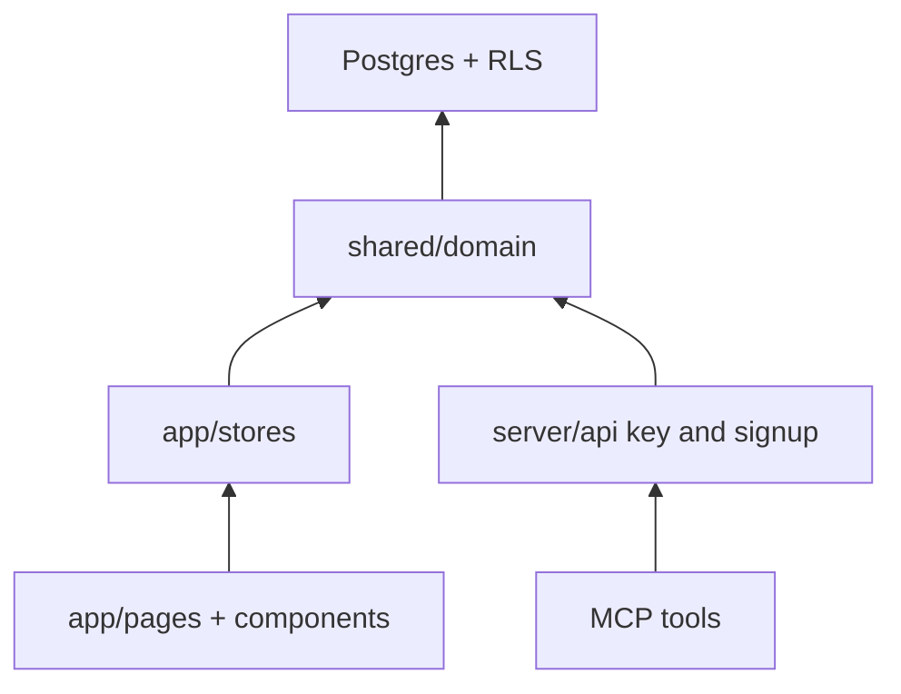
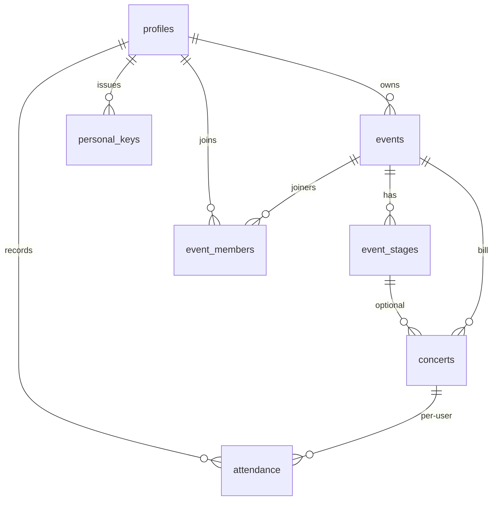
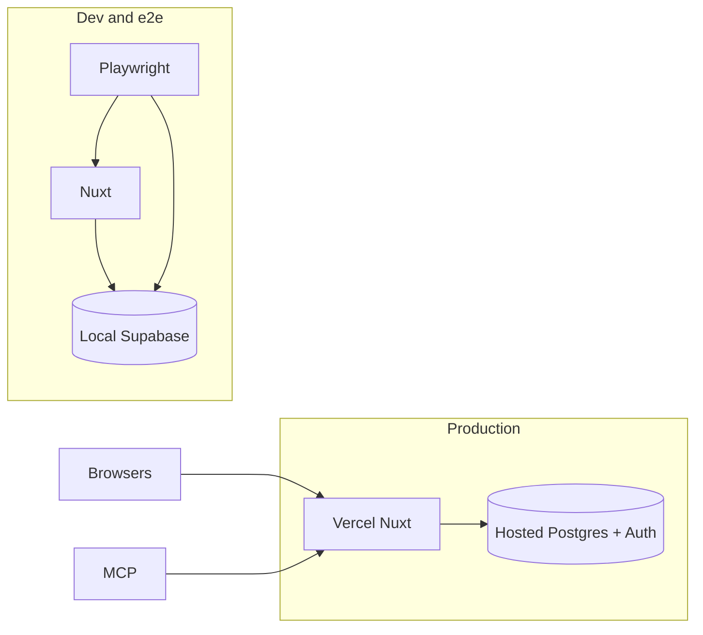

# Architecture Spine — LiveMemory

## Design Paradigm

Layered Nuxt with a Postgres security kernel. Presentation never talks to the database. Adapters never each invent queries. Postgres is the last word on who may read or write.

| Layer | Lives in | May depend on |
| --- | --- | --- |
| Presentation | `app/pages`, `app/components` | Pinia stores, Vue, Nuxt UI |
| Adapters | `app/stores`; MCP tools | domain module only (plus a user-scoped session) |
| Domain | `shared/domain` | user-scoped Supabase client (RLS as that User) |
| Exceptions | `server/api` | hashed personal keys, Auth; then domain with a user-scoped client |
| Kernel | `supabase/migrations` | nothing in the app |



MCP is a second adapter, not a second product. After UI CRUD exists it calls the same domain module as the signed-in User. Nitro never queries domain tables with the service role.

## Invariants & Rules

### AD-1 — Shared domain, Postgres kernel [ADOPTED]

- **Binds:** all writes and domain reads for CAP-1..CAP-7
- **Prevents:** Pinia and MCP each writing their own table queries; service-role MCP; product rules living only in Vue
- **Rule:** One isomorphic TypeScript domain module in `shared/domain` takes a **user-scoped** Supabase client (JWT/session of that User so RLS applies). Pinia stores, MCP tools, and pages must not query domain tables themselves (`events`, `concerts`, `attendance`, `event_members`, `event_stages`, personal keys, or views over them). Join, leave, Attendance, Concert create/attach, Event CRUD, and Shared List reads go through the domain module (Shared List may SELECT only the kernel public view in AD-2). SQL RPC is not the default. Nitro `server/api` exists only for personal-key exchange (AD-4) and registration (AD-6); after minting a user-scoped client it calls the domain module. `service_role` is forbidden for Event/Concert/Attendance/membership/stage reads and writes. Pages call stores; they do not fetch remote domain data.

### AD-2 — Two readers [ADOPTED]

- **Binds:** CAP-4, CAP-7, auth redirect, RLS
- **Prevents:** anonymous SELECT leaking notes, Bill-only rows, other Users' Attendance, or private Events; joiners reading owner notes; forcing login on the public profile via a privileged server read; enumerating disabled profiles
- **Rule:** Unauthenticated SELECT is allowed only through the kernel **public Shared List view**: enabled profiles; that User's **effective** `going`/`attended` Concerts (AD-3); grouped by Event; no notes; no unset Attendance; no empty Events. Notes are Event-**owner** SELECT only — members and visitors never see notes. Nobody SELECTS another User's Attendance. Disabled profile and unknown username are the same visitor result (not found); enabled-but-empty is a visible empty list. Event pages require a signed-in owner or member; unsigned Event visitors sign in with `redirect` back to that Event, then join (AD-8). Auth redirect excludes `/`, `/login`, `/confirm`, `/u/**`. Auth middleware on `/home`, `/concerts`, `/profile`, `/e/:id`. After `/confirm`, honor `redirect` to an Event URL; otherwise land on Home.

### AD-3 — Going becomes attended on read [ADOPTED]

- **Binds:** CAP-5, Shared List, MCP
- **Prevents:** UI showing attended while the public profile still shows Going; persist-on-read vs compute-on-read; a cron as a second mutation path
- **Rule:** No background job and no persist-on-read in v1. **Effective** Attendance is defined once in SQL (view or function): stored `going` that is past in Europe/Paris is exposed as `attended` (after optional clock time, else end of that Paris calendar day). UI, MCP, and Shared List read that definition — never the raw column for display. Writes must not store `going` on a past Concert (store `attended`). Future `attended` is rejected. `attended` cannot become `going`. Clear at the past boundary stays unset (delete the row).

### AD-4 — MCP personal key [ADOPTED]

- **Binds:** CAP-6
- **Prevents:** email/password in agent config; OAuth-for-v1; MCP acting as a superuser or using service_role
- **Rule:** The User creates and revokes a personal key in the app. MCP sends the key to a Nitro route that verifies a hash, **mints a user-scoped client**, and runs the domain module as that User (same RLS as the UI). Store hashes, never plaintext. v1 is revoke-only (no expiry policy). Screenshot interpretation stays outside LiveMemory.

### AD-5 — Opaque Event URL [ADOPTED]

- **Binds:** CAP-7, Event identity
- **Prevents:** sequential public ids; making a readable name the Event's identity in v1
- **Rule:** The Event page path is `/e/:id` where `:id` is the Event UUID. That URL is the unguessable Event link. Renaming the Event does not change it. A future pretty slug is an optional alias to this id, never a replacement. v1 does not ship vanity slugs.

### AD-6 — Username is the only label [ADOPTED]

- **Binds:** CAP-1, CAP-4, registration
- **Prevents:** cards using a display name while the public URL uses a different username; a v1 rename story; CAP-1 forking trigger vs Nitro
- **Rule:** One human identifier: `profiles.username`, chosen at registration with email and password in one step, unique case-insensitive (`a-z0-9_-`), immutable in v1. It is the Shared List path `/u/:username` and the name shown in the UI. Replace factory `display_name`. Collision copy: `This username is taken`. Extend factory `handle_new_user` to write `username` from signup metadata; keep `EXECUTE` revoked on security-definer functions. Unique index is the backstop. E2E account helpers must supply a username. Nitro signup only if the trigger path cannot be atomic.

### AD-7 — Civil Paris time, UUID ids [ADOPTED]

- **Binds:** CAP-3, CAP-5, all tables
- **Prevents:** two implementations inventing different UTC instants for dateless Concerts; public sequential numbers
- **Rule:** Event `start_date` and `end_date` are calendar dates (inclusive). Concert has a calendar date plus optional clock time. Values are civil Europe/Paris, stored as date/time-without-timezone, not as UTC-as-source-of-truth. Place is free text; Concert inherits Event place unless that Event allows per-Concert override. All entity ids (Event, Concert, Attendance, membership, stage, personal key) are UUIDs, like `auth.users`.

### AD-8 — Membership is not Attendance [ADOPTED]

- **Binds:** CAP-7, Home, Concerts
- **Prevents:** treating "has any Going/attended" as join; leave leaving orphan Attendance; putting the owner in the members table; a second join writer outside the domain module
- **Rule:** `events.owner_id` is the Event owner (Bill and notes). Joiners have a row in `event_members (event_id, user_id)`. Join and leave are domain operations: join inserts that row; leave deletes that row and that User's Attendance on that Event's Concerts. A member may have zero Attendance rows. Opening an Event URL after sign-in calls join. Moving a Concert does not auto-join source members to the target. Attendance follows the Concert id and remains visible only where that User may view the Concert.

### AD-9 — Stages are rows [ADOPTED]

- **Binds:** CAP-3, festival Concert entry
- **Prevents:** copied stage names going stale on rename
- **Rule:** Stages belong to one Event (`event_stages`: UUID + name). Concert references `stage_id`, not a name string. An empty list means a stage is not required. A non-empty list restricts Concerts to those ids. Rename does not detach Concerts.

### AD-10 — Concert identity on create [ADOPTED]

- **Binds:** CAP-1, CAP-2, CAP-6 (create Concert)
- **Prevents:** silent merge vs silent double-create; reparenting on "attach"; a Concert belonging to two Events; a worldwide artist database
- **Rule:** Every Concert belongs to exactly one Event (`concerts.event_id` not null, no junction). Scope of identity is the Event **owner's** journal, not all Users. Artist match is case-insensitive. Domain create returns exactly one of: `created`, `attached`, `needs_choice`, `impossible_place`. (1) same owner, artist, date, and clock time → `attached`: do not insert and do not change `event_id`; return the existing Concert (caller navigates there). (2) same owner, artist, date, time, different effective place → `impossible_place`: refuse. (3) same owner, artist, date, time missing on one or both sides → `needs_choice`; UI and MCP must ask: attach (may then set time on the existing row) or create a second Concert. (4) same artist, same date, different times → `created` allowed. Move between Events is a **separate** owner operation, not create/attach. Database unique-guards timed exact matches; the untimed case cannot be only a unique index. This **overrides** the former SPEC warn-then-allow duplicate rule. SPEC, PRD FR-13, and UX EXPERIENCE now match AD-10.

### AD-11 — Kernel and copy [ADOPTED]

- **Binds:** all mutations
- **Prevents:** TypeScript-only rules that the dashboard or a buggy adapter can skip; vague validation copy
- **Rule:** Hard product rules (ownership, membership, dates vs Concerts, stage list, username unique, timed Concert unique, past/future Attendance, one Event per Concert) are enforced in the database. The domain module turns failures into SPEC-shaped English messages that name the failed rule. Attendance unset is **no row**; `going` / `attended` is one row per User per Concert.

### AD-12 — Event kind, transparent create, attend-all [ADOPTED]

- **Binds:** CAP-2, CAP-5, CAP-7
- **Prevents:** two epics splitting soirée vs festival rules; attend-all on festivals; owner default Attendance on every add
- **Rule:** Event `kind` is `single_night` or `festival` (festivals span days; single-night uses the same start and end date). Transparent one-Concert create makes a `single_night` Event named `Concerts on DD/MM/YYYY at Place` (SPEC template) and sets the owner's Attendance to `going` or `attended` by the Paris boundary. That default does **not** apply when adding further Concerts. Attend-all is a one-shot domain action per User on Concerts **currently** on that `single_night` Bill. Festivals have no attend-all.

### AD-13 — Event and Concert dates save together [ADOPTED]

- **Binds:** CAP-3
- **Prevents:** Event-date epic and Concert-date epic deadlocking (Event blocked by Concerts, Concerts blocked by Event)
- **Rule:** An Event edit that would invalidate existing Concerts is blocked and lists those Concerts, unless the owner saves Event dates and Concert dates in **one** domain operation. Inclusive start/end.

### AD-14 — Environments and types [ADOPTED]

- **Binds:** deploy, CI, e2e, schema
- **Prevents:** Playwright against hosted Supabase; prerender failing without env; two schema sources
- **Rule:** Production is Vercel + one hosted Supabase at `https://livememory.pierre-reynaud.fr`. Schema changes are migrations only; commit `app/types/database.types.ts` from `pnpm db:types`. CI `build:vercel` must set `NUXT_PUBLIC_SUPABASE_URL` and `NUXT_PUBLIC_SUPABASE_KEY` (local demo values are enough to prerender). E2E runs against local Supabase only. Hosted schema is applied from `supabase/migrations`, not ad-hoc SQL. Preview/staging is the same stack if used; never point Playwright at remote. Backups and ops: hosted Supabase defaults; no second cloud.

## Consistency Conventions

| Concern | Convention |
| --- | --- |
| Naming | Product nouns from `entities.md`. Tables: `profiles`, `events`, `concerts`, `event_stages`, `event_members`, `attendance`, personal-key table. Files English. UI copy English; Attendance label `Going`. |
| Routes | `/` marketing; `/login` `/confirm`; `/home`; `/concerts`; `/profile`; `/e/:id`; `/u/:username`. |
| Home vs Concerts | Home: next 1–3 upcoming owned+joined Events, then three souvenir counts (attended Concerts, Events owned+joined, current going). Concerts is the full owned+joined log, empty owned Events included. |
| Ids | UUID primary keys. No public sequential numbers. |
| Dates | Civil Europe/Paris date + optional time. Do not convert dateless Concerts to a UTC instant. |
| Errors | Stores keep `{ data, error }`. Domain returns structured results including `created` / `attached` / `needs_choice` / `impossible_place` and errors with rule id + message. |
| State | Remote data in Pinia, not pages. No realtime in v1; refresh on revisit. List queries are set-based for the signed-in User (owned+joined), not per-Event round trips. Target: ~1000 Concerts usable (SPEC: list within 2 seconds). |
| Auth | `@nuxtjs/supabase` session for the browser. MCP: hashed personal key → Nitro → user-scoped client → domain. |
| Tests | Vitest on stores, domain, handlers. Playwright against **local** Supabase only. Every story adds or updates tests. Auto-imports stay off. E2E signup includes username. |
| Deletes | Owner deletes; non-empty Event confirms joiner impact and deletes Concerts + Attendance. Empty Event delete is enough to invalidate `/e/:id`. |

## Stack

Ratified from `package.json` on 2026-08-18. Current majors (Pinia 4, Vitest 4, TypeScript 7, Nuxt 4.5.2) are **not** adopted; stay on the factory carets. `@nuxtjs/supabase` is exact `2.0.9` (2.0.10 exists; do not bump in this spine). TypeScript 6 matches Nuxt UI peers.

| Name | Version |
| --- | --- |
| Nuxt | ^4.4.8 |
| Nuxt UI | ^4.10.0 |
| Pinia | ^3.0.4 |
| @pinia/nuxt | ^0.11.3 |
| @nuxtjs/supabase | 2.0.9 |
| Tailwind CSS | ^4.3.2 |
| Supabase CLI | ^2.76.0 |
| TypeScript | ^6.0.3 |
| Vitest | ^3.2.4 |
| @nuxt/test-utils | ^3.21.0 |
| Playwright | ^1.58.2 |
| pnpm | 11.13.1 |
| Vercel (Nuxt preset) | nuxt build --preset=vercel |

No Prisma. No PWA. Do not copy the old LiveMemory codebase.

## Structural Seed

```text
livememory-app/
  app/pages/              # screens only
  app/stores/             # Pinia adapters
  app/components/
  shared/domain/          # isomorphic Event/Concert/Attendance/membership
  server/api/             # personal key + signup only
  supabase/migrations/    # schema, RLS, constraints, public views
  tests/unit/
  tests/e2e/
```





Production URL: `https://livememory.pierre-reynaud.fr`. One cloud: Vercel + hosted Supabase. Playwright must not point at the remote URL.

## Capability → Architecture Map

| Capability / Area | Lives in | Governed by |
| --- | --- | --- |
| CAP-1 Register, session, owner Event/Concert CRUD | `profiles`, `handle_new_user`, domain, auth store | AD-1, AD-6, AD-10, AD-11, AD-12 |
| CAP-2 Events as groups, transparent create, Home vs Concerts | domain + Pinia; `/home` `/concerts` `/e/:id` | AD-5, AD-8, AD-12 |
| CAP-3 Dates, place, stages, incompatible Event edits | migrations + domain | AD-7, AD-9, AD-11, AD-13 |
| CAP-4 Shared List | kernel public view + `/u/:username` | AD-2, AD-3, AD-6 |
| CAP-5 Attendance, attend-all, auto-attended | `attendance` + effective-attendance SQL | AD-3, AD-8, AD-11, AD-12 |
| CAP-6 MCP | personal key route + same domain module | AD-1, AD-4, AD-10 |
| CAP-7 Join, Bill view, own Attendance, leave | domain join/leave + Event page | AD-2, AD-5, AD-8 |

## Deferred

- Pretty Event slugs for selected big Events (v2): optional alias to the UUID; identity stays AD-5.
- MCP protocol library and process hosting: bind only AD-1 and AD-4; choose the SDK when CAP-6 is built (after UI CRUD).
- SQL RPC as the default mutation style: reserved if a mutation cannot stay correct in TypeScript plus RLS.
- Extra preview/staging product (AD-14 already forbids remote Playwright and a second cloud).
- Realtime fan-out, username rename, Event-link rotation, owner kick, joiner roster, joiner notes, concert duration / overlap windows, import from old LiveMemory, OAuth for MCP, PWA.
- Concert duration / overlap windows beyond AD-10 (same artist + date + different times remain allowed).
